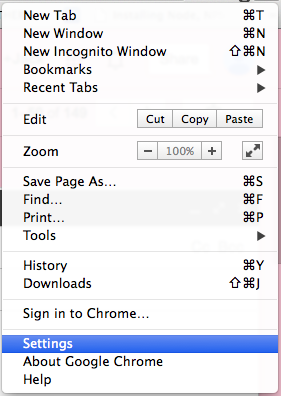
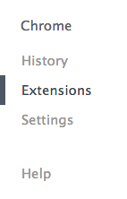
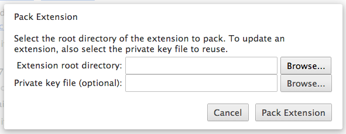
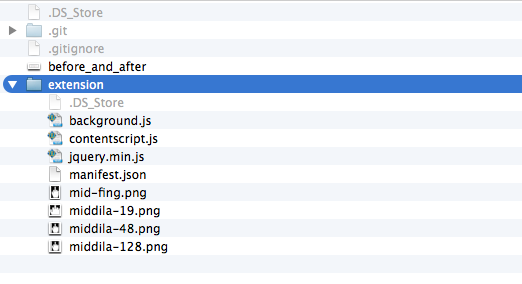

middila
=======

Per the farcical suggestion of a beloved Mac pundit, all 'Album Only' text in Chrome is turned into a middle finger. Inspired by Andy Inhatko who is not affiliated with this software in any way.

 
Almost entirely based on the page action by content sample extension provide by Google  [here](http://chrome-apps-doc2.appspot.com/trunk/extensions/samples.html#fad62e9f7f55a4c7a8add7662b166779)

instructions
--------
**In Chrome, open Settings** 
 
 
**Then select Extensions in the menu on the left** 
 
 
**Click the Pack Extension button** 
 
**Browse to the Extension folder *(WITHIN the containing middila folder)*** 
 
**Select the Extension folder within the middila folder** 
 
**Then pack it up, pack it in.**
