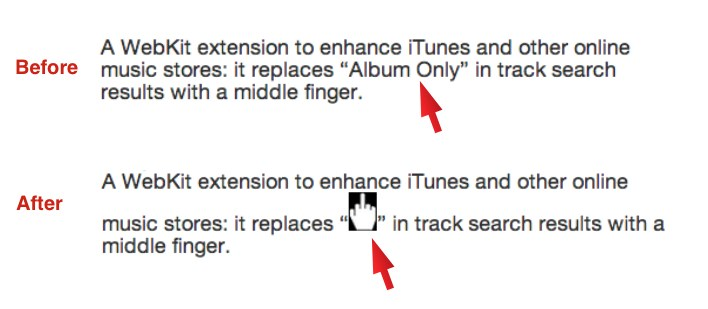

middila Chrome Extension
=======

Per the farcical suggestion of a beloved Mac pundit, all 'Album Only' text in Chrome is turned into a middle finger. Inspired by Andy Inhatko who is not affiliated with this software in any way.

 
Almost entirely based on the page action by content sample extension provide by Google  [here](http://chrome-apps-doc2.appspot.com/trunk/extensions/samples.html#fad62e9f7f55a4c7a8add7662b166779)

 
instructions to use
--------
Open Chrome settings 
Choose Extensions from the menu on the left 
Click the Developer mode checkbox 
Click the 'Load Unpacked Extension' button. 
*Be sure to select the Extensions folder within the middila folder* 
You can test it by reloading this page. You will see these words: Album Only replaced with a middle finger. 
